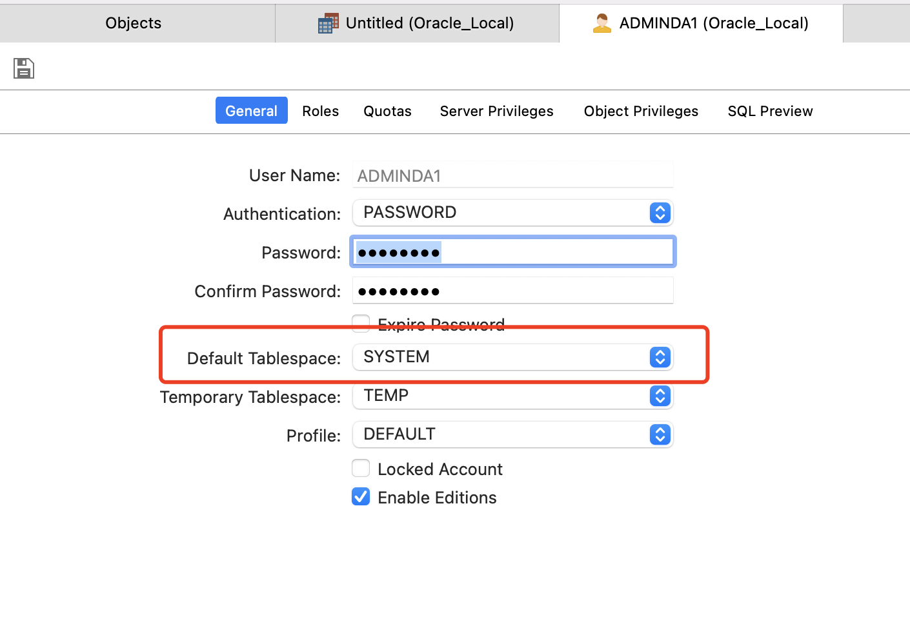
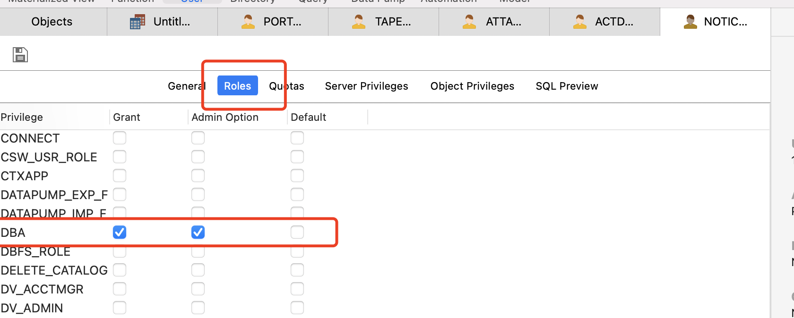
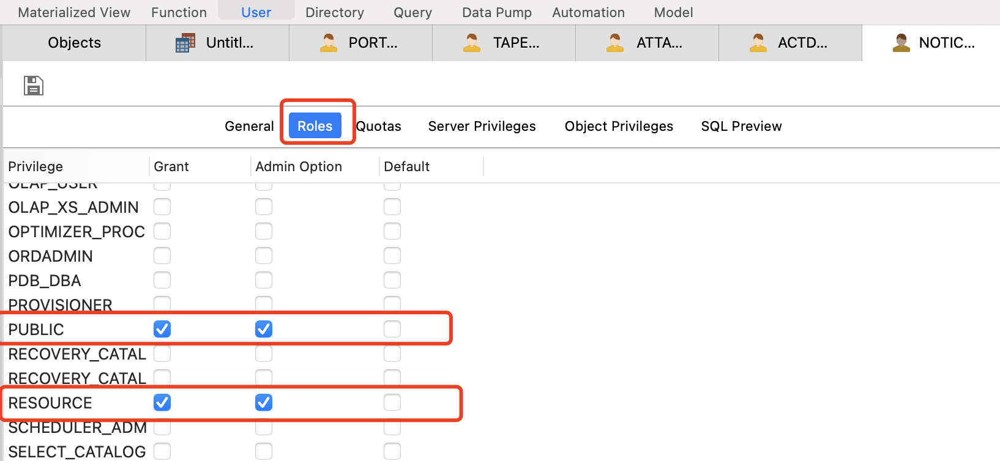
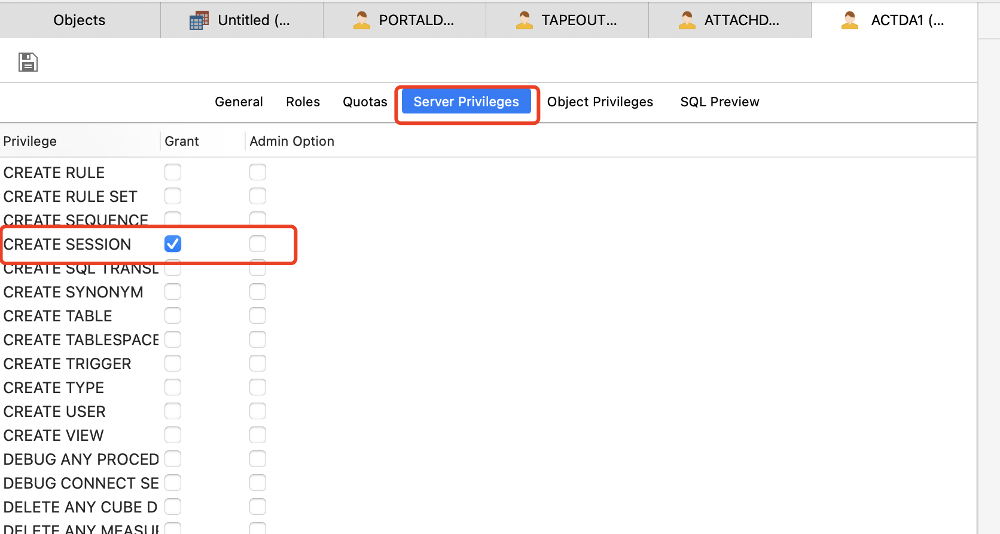

## 安装Oracle

1、推荐使用容器安装Oracle，下载镜像，如下所示

``` shell
docker pull sath89/oracle-12c
```

2、运行容器，并指定对外端口

``` shell
docker run -d --name oracle  -p 1521:1521 -v 本地路径:/mnt -e TZ=Asia/Shanghai sath89/oracle-12c
```
运行容器成功后，容器提供了默认的账号信息，如下
```
hostname: localhost
port: 1521
sid: xe
username: system
password: oracle
```

## 扩展(创建用户并登录)
1、 创建账号


2、授权




